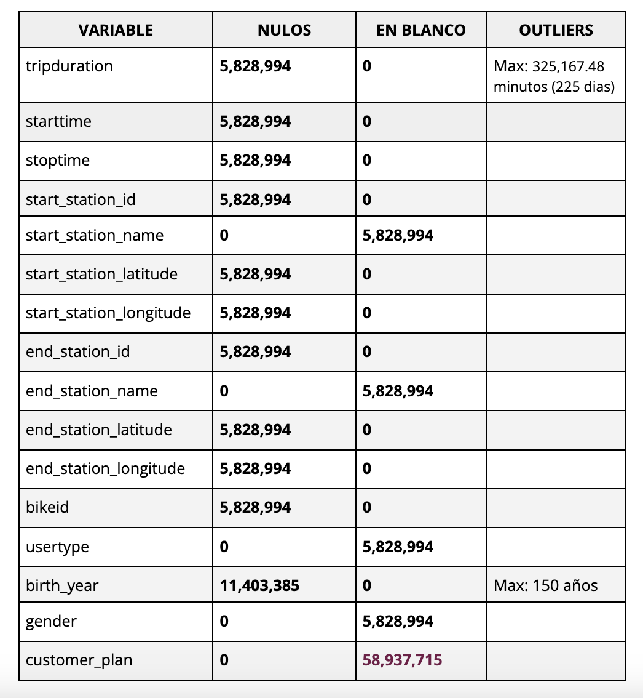

# Citi Bike Trips Data Analysis

Exploración de datos a partir de un dataset sobre el uso de un programa de bicicletas compartidas, realizado en el marco del bootcamp de análisis de datos de Laboratoria

 ## Descripción del proyecto 

 En el contexto del proceso de onboarding de la nueva CEO de la empresa de viajes compartidos en bicicleta, se ha asignado al equipo de analistas de datos la elaboración de un informe que incluya métricas y datos generales sobre el uso del servicio. Para cumplir con esta tarea, es fundamental entender la estructura de los datos, analizarlos en profundidad y crear visualizaciones que comuniquen los hallazgos de manera clara y efectiva.

 ## Metodología 

- Base de datos: Citi Bike New York City, conjunto de datos público alojado en Google BigQuery.
- Herramientas: Big Query, Looker Studio.
- Lenguaje: SQL

### 1. Procesamiento y preparación de de datos

- Carga de  base de datos Citi Bike New York City, este conjunto de datos incluye los viajes de Citi Bike desde que Citi Bike se lanzó en septiembre de 2013 y se actualiza diariamente. Cualquier viaje de menos de 60 segundos de duración, los cuales se consideran falsos comienzos: *citibike_trips*
- Exploración: contiene 58,937,715 datos
- Estado: se identifican nulos, en blancos, lo que requiere filtrarlos para el análisis.
- La variable *tripduration* se encuentra en segundos, es necesario convertirla a minutos.
- La variable *tripduration* y *age* contiene datos outliers.

 


### 2. Análisis exploratorio

1. Métricas de uso de un día promedio: 
    * Número de viajes que se realizan en promedio: utilizando la funcion `DATE`se convierte la variable *starttime* en fecha y luego se calcula el promedio de viajes.

``` sql
WITH daily_trip_counts AS (
  SELECT 
    DATE(starttime) AS trip_date, 
    COUNT(*) AS trips_per_day
  FROM 
    `citibikemetrics24.citibike_trips.citibike_trips`
  WHERE 
    starttime IS NOT NULL
  GROUP BY
  trip_date
  )
SELECT 
  AVG(daily_trip_counts.trips_per_day) AS avd_dtrips
FROM 
  daily_trip_counts; ---32,986.78
```
    * Calcular medidas de tendencia central respecto a la duración de un viaje: Se decide tratar los  datos outliers de la variable *tripduration*, considerando solo los datos dentro de 24 horas (1440 minutos), ya que el objetivo es analizar la duración de un viaje en un día promedio. 

``` sql
SELECT
   MAX(tripduration / 60) AS max_trip_duration, 
   MIN(tripduration / 60) AS min_trip_duration, 
   AVG(tripduration / 60) AS avg_trip_duration, 
   STDDEV(tripduration / 60) AS stddev_trip_duration 
FROM
   `bikeshare-metrics.CitiBike_Trips.tabletrips`
WHERE
   tripduration IS NOT NULL 
   AND tripduration / 60 <= 1440; -- Excluye viajes con duración mayor a 24 horas (outliers)
```


2. * Métricas históricas:
    a.** Total de viajes: Filtrando los datos nulos de la variable *starttime* y *stoptime* se obtienen 53,108,721 viajes 

``` sql
SELECT
   COUNT(starttime) AS total_trips
FROM
   `citibikemetrics24.citibike_trips.citibike_trips`
WHERE
   starttime IS NOT NULL
   AND stoptime IS NOT NULL;
```
    b.** Total de viajes por usuarios, según género, edad y/o tipo de subscripción: 

``` sql
    # total trips by gender #

SELECT 
    gender, 
    COUNT(starttime) AS total_trips
FROM 
    `citibikemetrics24.citibike_trips.citibike_trips` 
WHERE
    starttime IS NOT NULL
    AND gender != ''
GROUP BY 
    gender
ORDER BY 
    total_trips DESC
LIMIT 100; --- hombres 35611787 (67.06%)
           --- mujeres 11376412 (21.42%)
           --- desconocidos 6120522 (11.52%)
```
``` sql
# total trips by user #

SELECT 
    usertype, 
    COUNT(starttime) AS total_trips
FROM 
    `citibikemetrics24.citibike_trips.citibike_trips`
WHERE
    starttime IS NOT NULL
    AND usertype != ''
GROUP BY 
    usertype
ORDER BY 
    total_trips DESC
LIMIT 100; --- subscriber (annual member) : 46,917,572 (79.6%)  
           --- customer (24 pass or 7 day pass user): 6,191,149 (20,4%)
```
Para la identificación de la edad es necesaria la variable *birth_year*, se agrupan por rangos las edades y se categorizan por  generación. Existen 42 usuarios con edad +90 años, o sea outliers, por lo que se decide excluirlos:

``` sql

CREATE OR REPLACE VIEW `citibikemetrics24.citibike_trips.age_ranges_view` AS 
SELECT 
    birth_year,
    CASE 
        WHEN 2024 - birth_year BETWEEN 20 AND 29 THEN '20-29'
        WHEN 2024 - birth_year BETWEEN 30 AND 39 THEN '30-39'
        WHEN 2024 - birth_year BETWEEN 40 AND 49 THEN '40-49'
        WHEN 2024 - birth_year BETWEEN 50 AND 59 THEN '50-59'
        WHEN 2024 - birth_year BETWEEN 60 AND 69 THEN '60-69'
        WHEN 2024 - birth_year BETWEEN 70 AND 79 THEN '70-79'
        WHEN 2024 - birth_year BETWEEN 80 AND 90 THEN '80-90'
        ELSE 'Other'
    END AS age_range,
    CASE 
        WHEN 2024 - birth_year BETWEEN 20 AND 39 THEN 'Millennials'
        WHEN 2024 - birth_year BETWEEN 40 AND 59 THEN 'Generación X'
        WHEN 2024 - birth_year BETWEEN 60 AND 79 THEN 'Baby Boomers'
        WHEN 2024 - birth_year BETWEEN 80 AND 90 THEN 'Silent Generation'
        ELSE 'Other'
    END AS generation
FROM 
    `citibikemetrics24.citibike_trips.citibike_trips`
WHERE 
    birth_year IS NOT NULL
    AND 2024 - birth_year BETWEEN 20 AND 90;
```
Se obtiene como resultado estas tablas:


    c.** Crecimiento del número de viajes diarios a lo largo del tiempo: para este calculo se crean tres tablas temporables mediante `WITH`, en la primera se grupan los datos por fecha (*trip_date*) y calcula el número total de viajes (*daily_trips*) para cada día. Seguido, en la siguiente tabla temporal, utilizando la funcion `LAG` se obtiene el número de viajes del día anterior y en la tercera se calcula la tasa de crecimiento anual de los viajees, crean las variables que contiene el año (*year*), el número total de viajes anuales (*total_viajes_anuales*), el número de viajes del año anterior (*previous_year_trips*), y la tasa de crecimiento anual (*annual_growth_rate*).  Finalmente se combinan para producir la vista final. Esta tabla será utilizada para visualizar el comportamiento mediante gráficos.

``` sql

CREATE OR REPLACE VIEW `citibikemetrics24.citibike_trips.growth_daily_year` AS 
WITH daily_data AS (
  SELECT
    DATE(starttime) AS trip_date,
    COUNT(*) AS daily_trips
  FROM
    `citibikemetrics24.citibike_trips.citibike_trips`
  WHERE
    starttime IS NOT NULL
  GROUP BY
    trip_date
  ORDER BY
    trip_date ASC
),

daily_growth AS (
  SELECT
    trip_date,
    daily_trips,
    LAG(daily_trips) OVER (ORDER BY trip_date) AS previous_day_trips,
    CASE 
      WHEN LAG(daily_trips) OVER (ORDER BY trip_date) = 0 THEN NULL
      ELSE (daily_trips - LAG(daily_trips) OVER (ORDER BY trip_date)) / LAG(daily_trips) OVER (ORDER BY trip_date) * 100 
    END AS daily_growth_rate
  FROM
    daily_data
),

annual_growth AS (
  SELECT
    year,
    total_viajes_anuales,
    LAG(total_viajes_anuales) OVER (ORDER BY year) AS previous_year_trips,
    CASE 
      WHEN LAG(total_viajes_anuales) OVER (ORDER BY year) = 0 THEN NULL
      ELSE (total_viajes_anuales - LAG(total_viajes_anuales) OVER (ORDER BY year)) / LAG(total_viajes_anuales) OVER (ORDER BY year) * 100 
    END AS annual_growth_rate
  FROM (
    SELECT
      EXTRACT(YEAR FROM trip_date) AS year,
      SUM(daily_trips) AS total_viajes_anuales
    FROM
      daily_data
    GROUP BY
      year
    ORDER BY
      year ASC
  ) AS yearly_data
)

SELECT
  d.trip_date,
  d.daily_trips,
  d.daily_growth_rate,
  a.year,
  a.total_viajes_anuales,
  a.annual_growth_rate
FROM
  daily_growth d
LEFT JOIN
  annual_growth a ON EXTRACT(YEAR FROM d.trip_date) = a.year
ORDER BY
  d.trip_date;
```
3. * Medidas adicionales:
    a.* se identifican los top 5 de estaciones donde es más popular inicar y finalizar los viajes:

``` sql
SELECT 
    start_station_name, 
    COUNT(*) AS total_trips
FROM 
    `bikeshare-metrics.CitiBike_Trips.tabletrips`
WHERE 
    start_station_name IS NOT NULL
    AND start_station_name != ''
GROUP BY 
    start_station_name
ORDER BY 
    total_trips DESC;
```
### 3. Reporte en Looker Studio

- Se conectan las tablas creadas con las variables de interés para la presentación.
- Gráficos: se utilizan scorecards, gráficos de barra, de pastel, tablas y gráficos de linea.

#### Vista de dasboard: reto_técnico_Citibike


 ## Resultados 

 Citi Bike es el sistema de bicicletas compartidas de Nueva York, con miles de bicicletas distribuidas en cientos de estaciones, disponibles las 24 horas del día, todos los días del año. Los usuarios pueden desbloquear una bicicleta en cualquier estación y viajar a su destino preferido, eligiendo entre pases de 24 horas, 7 días o una suscripción anual.

Desde su lanzamiento en 2013, la base de datos de Citi Bike ha registrado más de 53 millones de viajes. En promedio, se realizan 32,986 viajes diarios, con una duración máxima de 1,439 minutos (casi un día) y una mínima de 1 minuto. La duración promedio de los viajes es de 14.6 minutos.

En cuanto al perfil de los usuarios, el 67.06% son hombres, el 21.42% son mujeres y el 11.52% restante no especificó su género. Además, el sistema está compuesto por 46,917,572 suscriptores anuales (79.6%) y 6,191,149 clientes con pases de corto plazo (24 horas o 7 días) que representan el 20.4%. También se pueden identificar las estaciones más populares donde los viajes comienzan y terminan diariamente.

Respecto a la tasa de crecimiento anual de los viajes, se observa un incremento constante desde 2013 hasta 2015. Sin embargo, a partir de 2015, el crecimiento se desacelera y, para 2018, se registra una disminución significativa en el número de viajes diarios en comparación con 2017. A pesar de que el número total de viajes fue relativamente alto entre 2014 y 2017, la tasa de crecimiento anual comenzó a decrecer, lo que sugiere que el sistema pudo haber alcanzado un punto de saturación o que otros factores afectaron negativamente su uso, particularmente en 2018. Este descenso invita a explorar posibles variables que hayan influido en esta caída.

## Elaborado por:  

Natalia Alejandro  
Agosto 2024

